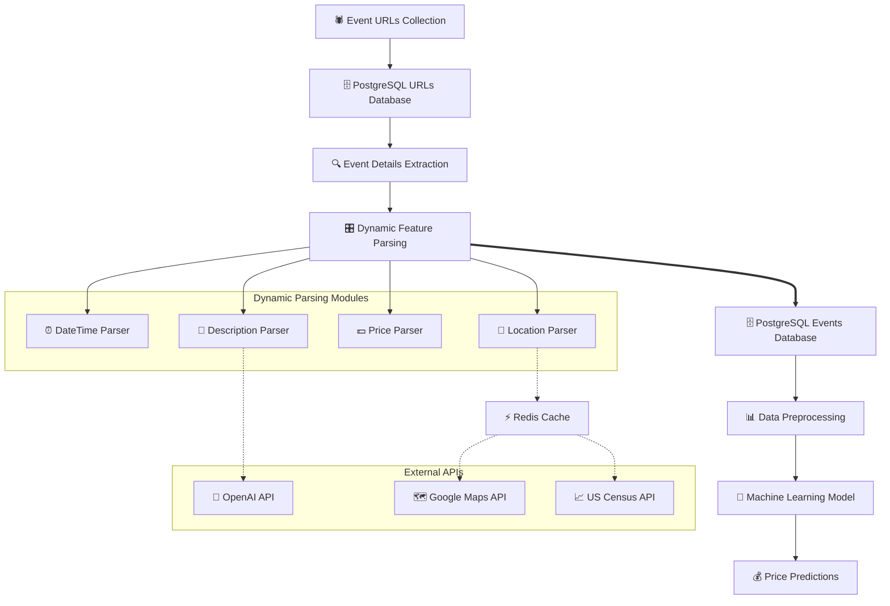

# 🎯 Dynamic Pricing Engine for Events

<div align="center">

[](https://python.org)
[](https://scikit-learn.org)
[](https://eventbrite.com)

</div>

> **🚀 An intelligent event pricing system that leverages machine learning to analyze and predict optimal ticket prices based on comprehensive event and location data.**

---

## 📋 Table of Contents

- [🎯 Dynamic Pricing Engine for Events](#-dynamic-pricing-engine-for-events)
  - [📋 Table of Contents](#-table-of-contents)
  - [🌟 Project Overview](#-project-overview)
  - [✨ Key Features](#-key-features)
  - [🏗️ System Architecture](#️-system-architecture)
  - [📊 Data Pipeline](#-data-pipeline)
  - [🧠 Machine Learning Model](#-machine-learning-model)
  - [🎛️ Dynamic Feature Extraction](#️-dynamic-feature-extraction)
  - [📁 Project Structure](#-project-structure)
  - [🚀 Getting Started](#-getting-started)
  - [📈 Current Status](#-current-status)
  - [🛠️ Technologies Used](#️-technologies-used)
  - [📊 Database Schema](#-database-schema)
  - [🔧 Configuration](#-configuration)
  - [📝 Usage Examples](#-usage-examples)
  - [🤝 Contributing](#-contributing)
  - [📄 License](#-license)

---

## 🌟 Project Overview

The **Dynamic Pricing Engine** is a comprehensive system designed to revolutionize event pricing through data-driven insights. By scraping, analyzing, and learning from thousands of events across major U.S. cities, this system provides intelligent pricing recommendations based on multiple factors including location demographics, event characteristics, timing, and market dynamics.

### 🎯 **Mission Statement**

_To democratize intelligent pricing for event organizers by providing data-driven insights that optimize revenue while ensuring fair and competitive ticket prices._

---

## ✨ Key Features

### 🔍 **Intelligent Data Collection**

- **Web Scraping**: Automated collection of event data from Eventbrite across 6 major cities
- **Rate-Limited Processing**: Respectful API usage with built-in rate limiting and retry mechanisms
- **Robust Error Handling**: Comprehensive error tracking and recovery systems

### 🌍 **Comprehensive Location Intelligence**

- **Geographic Analysis**: Precise geocoding with neighborhood identification
- **POI Density Analysis**: Food & beverage, accessibility, and lodging density scoring
- **Demographic Insights**: Integration with U.S. Census data for income, population, and age demographics
- **Redis Caching**: Optimized performance for location-based queries

### 🤖 **AI-Powered Content Analysis**

- **OpenAI Integration**: Automated event categorization and feature extraction
- **Semantic Analysis**: Event mood, target audience, and uniqueness detection
- **Natural Language Processing**: Description parsing for pricing-relevant features

### 📊 **Advanced Analytics**

- **Temporal Analysis**: Time-of-day, seasonality, and weekend premium detection
- **Price Modeling**: Random Forest regression for accurate price prediction
- **Feature Engineering**: 20+ engineered features for comprehensive analysis

---

## 🏗️ System Architecture



---

## 📊 Data Pipeline

### 🌐 **Phase 1: URL Collection** _(Completed)_

- **Coverage**: 6 major U.S. cities (San Francisco, New York, Chicago, Atlanta, Miami, Los Angeles)
- **Scope**: 20 pages per city of paid events
- **Storage**: PostgreSQL with duplicate prevention and status tracking

### 🔍 **Phase 2: Event Data Extraction** _(Completed)_

- **Processing**: Individual event page scraping with retry logic
- **Rate Limiting**: 3 requests per 60 seconds for OpenAI API compliance
- **Error Handling**: Failed attempts tracked with automatic retry mechanisms

### 🧹 **Phase 3: Data Preprocessing** _(Completed)_

- **Cleaning**: Removal of low-frequency categories and invalid entries
- **Feature Engineering**: Weekend detection, categorical encoding, and normalization
- **Validation**: Data quality checks and outlier detection

---

## 🧠 Machine Learning Model

### 🎯 **Current Model: Random Forest Regressor**

- **Algorithm**: Random Forest with 100 estimators
- **Target Variable**: Event ticket price
- **Features**: 20+ engineered features including:
  - **Temporal**: Timing type, time of day, weekend indicator
  - **Geographic**: POI densities, demographic data, location scores
  - **Event-specific**: Type, target audience, mood/energy, freebies
  - **Market**: Uniqueness, seasonality factors

### 📈 **Model Performance**

- **Evaluation Metric**: Mean Squared Error (MSE)
- **Data Split**: 80/20 train-test split with random state for reproducibility
- **Feature Selection**: One-hot encoding for categorical variables

---

## 🎛️ Dynamic Feature Extraction

### ⏰ **DateTime Analysis** (`dynamic_parsing/datetime.py`)

- **Multi-format Support**: Handles various date/time formats and timezones
- **Event Duration**: Automatic calculation of event length
- **Seasonal Detection**: Holiday and seasonal event identification
- **Time Categories**: Morning, afternoon, evening, night classification

### 📍 **Location Intelligence** (`dynamic_parsing/location.py`)

- **Google Maps Integration**: Precise geocoding and address standardization
- **POI Analysis**: Density and popularity scoring for nearby amenities
- **Census Integration**: Demographic data enrichment
- **Caching System**: Redis-based caching for API efficiency

### 💰 **Price Extraction** (`dynamic_parsing/price.py`)

- **Format Normalization**: Standardized price extraction from various formats
- **Currency Handling**: USD-focused with format validation
- **Range Processing**: Handling of price ranges and promotional pricing

### 📝 **Content Analysis** (`dynamic_parsing/description.py`)

- **AI Categorization**: OpenAI-powered event type classification
- **Audience Detection**: Target demographic identification
- **Mood Analysis**: Event energy and atmosphere classification
- **Feature Extraction**: Freebies and uniqueness detection

---

## 📁 Project Structure

```

Dynamic-Events/
├── 🗂️ Data/
│ ├── 📄 events_data.csv # Raw scraped event data
│ └── 📄 cleaned_data.csv # Preprocessed data for ML
├── 🧠 model/
│ ├── 📄 data_loader.py # PostgreSQL to CSV export
│ ├── 📄 data_preprocess.py # Data cleaning and feature engineering
│ └── 📄 train.py # ML model training and evaluation
├── 🔧 dynamic_parsing/
│ ├── 📄 **init**.py
│ ├── 📄 datetime.py # Temporal feature extraction
│ ├── 📄 description.py # AI-powered content analysis
│ ├── 📄 location.py # Geographic and demographic features
│ └── 📄 price.py # Price normalization and extraction
├── 🕷️ scrapping-urls.py # Event URL collection system
├── 🕷️ scrapping-events.py # Event details extraction pipeline
├── 🔍 extract_event_details.py # Core event processing logic
├── 🗄️ schema-urls.sql # URL storage database schema
├── 🗄️ schema-events.sql # Events database schema
├── 📋 requirements.txt # Python dependencies
└── 📖 README.md # This file

```

---

## 🚀 Getting Started

### 📋 **Prerequisites**

- **Python**: 3.13+
- **PostgreSQL**: 12+
- **Redis**: 6+ (for location caching)
- **API Keys**:
  - OpenAI API key
  - Google Maps API key
  - U.S. Census API key

### ⚡ **Quick Setup**

1. **Clone the Repository**

   ```bash
   git clone https://github.com/John-Aradan/Dynamic-Pricing-Engine.git
   cd Dynamic-Pricing-Engine
   ```

2. **Install Dependencies**

   ```bash
   pip install -r requirements.txt
   ```

3. **Environment Configuration**

   ```bash
   # Create .env file with your API keys
   POSTGRESQL_HOST=your_host
   POSTGRESQL_PASSWORD=your_password
   OPENAI_API_KEY=your_openai_key
   GOOGLE_MAPS_API_KEY=your_gmaps_key
   CENSUS_API_KEY=your_census_key
   ```

4. **Database Setup**

   ```bash
   # Run the SQL schema files to create tables
   python scrapping-urls.py     # Creates URL schema
   python scrapping-events.py   # Creates events schema
   ```

5. **Start Processing**
   ```bash
   # Run the complete pipeline
   python scrapping-urls.py      # Collect event URLs
   python scrapping-events.py    # Extract event details
   python model/data_loader.py   # Export to CSV
   python model/data_preprocess.py # Clean and preprocess
   python model/train.py         # Train ML model
   ```

---

## 📈 Current Status

### ✅ **Completed Milestones**

| Module                     | Status      | Description                              |
| -------------------------- | ----------- | ---------------------------------------- |
| 🕷️ **URL Scraping**        | ✅ Complete | Event URLs collected from 6 major cities |
| 🔍 **Data Extraction**     | ✅ Complete | Individual event details extracted       |
| 🧠 **Feature Engineering** | ✅ Complete | 20+ features engineered from raw data    |
| 🤖 **AI Integration**      | ✅ Complete | OpenAI-powered content analysis          |
| 🗄️ **Database Schema**     | ✅ Complete | PostgreSQL schemas with error tracking   |
| 📊 **Data Preprocessing**  | ✅ Complete | Cleaned dataset ready for ML             |
| 🎯 **ML Model**            | ✅ Complete | Random Forest baseline model trained     |

### 🚧 **In Progress**

- **Model Optimization**: Hyperparameter tuning and feature selection
- **Validation Framework**: Cross-validation and performance metrics
- **Documentation**: API documentation and usage examples

### 🔮 **Upcoming Features**

- **Advanced Models**: XGBoost, Neural Networks, Ensemble methods
- **Real-time Predictions**: API endpoint for live pricing
- **A/B Testing Framework**: Price optimization testing
- **Web Dashboard**: Interactive visualization and monitoring
- **Market Analysis**: Competitive pricing insights

---

## 🛠️ Technologies Used

### 🐍 **Core Technologies**

- **Python 3.13**: Main programming language
- **PostgreSQL**: Primary data storage
- **Redis**: Caching layer for API optimization
- **Pandas**: Data manipulation and analysis
- **Scikit-learn**: Machine learning framework

### 🌐 **Web & APIs**

- **BeautifulSoup4**: Web scraping and HTML parsing
- **Requests**: HTTP client for web scraping
- **OpenAI API**: AI-powered content analysis
- **Google Maps API**: Geocoding and location intelligence
- **U.S. Census API**: Demographic data enrichment

### 📊 **Data & ML Libraries**

- **NumPy**: Numerical computing
- **DateParser**: Advanced date/time parsing
- **Geopy**: Geographic calculations
- **Pydantic**: Data validation and serialization
- **tqdm**: Progress bars and monitoring

---

## 📊 Database Schema

### 🔗 **URLs Table** (`schema_urls`)

```sql
CREATE TABLE schema_urls (
    id TEXT PRIMARY KEY,           -- SHA-256 hash of URL
    url TEXT UNIQUE NOT NULL,      -- Event URL
    status TEXT DEFAULT 'Pending', -- Processing status
    no_attempts INT DEFAULT 0,     -- Retry counter
    last_attempt TIMESTAMP,        -- Last processing attempt
    reason TEXT                    -- Error reason if failed
);
```

### 🎪 **Events Table** (`schema_events`)

```sql
CREATE TABLE schema_events (
    id TEXT PRIMARY KEY,              -- Event identifier
    title TEXT NOT NULL,              -- Event title
    url TEXT,                         -- Source URL
    -- Temporal Features
    local_start TIMESTAMP NOT NULL,   -- Local start time
    utc_start TIMESTAMP NOT NULL,     -- UTC start time
    local_end TIMESTAMP,              -- Local end time
    utc_end TIMESTAMP,                -- UTC end time
    timing_type TEXT NOT NULL,        -- Single/Multi day classification
    duration INT,                     -- Duration in minutes
    time_of_day TEXT NOT NULL,        -- Morning/Afternoon/Evening/Night
    day_of_week TEXT NOT NULL,        -- Day of week
    event_season TEXT,                -- Holiday/Seasonal classification
    -- Location Features
    formatted_address TEXT,           -- Full address
    zip TEXT NOT NULL,                -- ZIP code
    lat FLOAT NOT NULL,               -- Latitude
    lon FLOAT NOT NULL,               -- Longitude
    neighborhood TEXT,                -- Neighborhood name
    -- POI Features
    food_bev_density FLOAT NOT NULL,  -- Food & beverage POI density
    food_bev_pop_score FLOAT NOT NULL,-- Food & beverage popularity
    access_density FLOAT NOT NULL,    -- Transportation accessibility
    access_pop_score FLOAT NOT NULL,  -- Access popularity score
    lodging_density FLOAT NOT NULL,   -- Hotel/lodging density
    lodging_pop_score FLOAT NOT NULL, -- Lodging popularity score
    -- Demographic Features
    average_income_zip FLOAT NOT NULL,-- Average income in ZIP
    population_zip INT NOT NULL,      -- Population in ZIP
    median_age_zip FLOAT NOT NULL,    -- Median age in ZIP
    -- Event Features
    event_type TEXT,                  -- Event category
    target_audience TEXT NOT NULL,    -- Primary audience
    event_mood_energy TEXT NOT NULL,  -- Event atmosphere
    freebies_included TEXT NOT NULL,  -- Free items indicator
    uniqueness TEXT,                  -- Uniqueness indicator
    -- Target Variable
    price FLOAT NOT NULL              -- Ticket price
);
```

---

## 🔧 Configuration

### 🌍 **Environment Variables**

Create a `.env` file in the root directory:

```env
# Database Configuration
POSTGRESQL_HOST=localhost
POSTGRESQL_PASSWORD=your_secure_password

# API Keys
OPENAI_API_KEY=sk-your-openai-key
GOOGLE_MAPS_API_KEY=your-google-maps-key
CENSUS_API_KEY=your-census-api-key

# Optional: Redis Configuration
REDIS_HOST=localhost
REDIS_PORT=6379
REDIS_DB=0
```

### ⚙️ **Model Configuration**

Modify parameters in `model/train.py`:

```python
# Random Forest Configuration
rf = RandomForestRegressor(
    n_estimators=100,      # Number of trees
    random_state=42,       # Reproducibility
    max_depth=None,        # Maximum tree depth
    min_samples_split=2,   # Minimum samples to split
    min_samples_leaf=1     # Minimum samples per leaf
)

# Data Split Configuration
train_test_split(X, y,
    test_size=0.2,         # 20% for testing
    random_state=42        # Reproducible split
)
```

---

## 📝 Usage Examples

### 🎯 **Training the Model**

```python
from model.train import *

# Load and preprocess data
df = pd.read_csv('Data/cleaned_data.csv')
X = df.drop(columns=['id', 'price'])
y = df['price']

# One-hot encode categorical variables
X = pd.get_dummies(X, columns=[
    'timing_type', 'time_of_day', 'event_type',
    'target_audience', 'event_mood_energy',
    'freebies_included', 'is_weekend'
], drop_first=True, dtype=int)

# Train model
X_train, X_test, y_train, y_test = train_test_split(X, y, test_size=0.2)
rf = RandomForestRegressor(n_estimators=100, random_state=42)
rf.fit(X_train, y_train)

# Evaluate
y_pred = rf.predict(X_test)
mse = mean_squared_error(y_test, y_pred)
print(f"Model MSE: {mse}")
```

### 🔍 **Extracting Event Features**

```python
from extract_event_details import extract_event_details

# Extract features from a single event
event_url = "https://www.eventbrite.com/e/sample-event-123456789"
event_id = "abc123"

try:
    features = extract_event_details(event_id, event_url)
    print(f"Event: {features['title']}")
    print(f"Price: ${features['price']}")
    print(f"Location: {features['formatted_address']}")
    print(f"Type: {features['event_type']}")
except Exception as e:
    print(f"Extraction failed: {e}")
```

### 📊 **Data Analysis Examples**

```python
import pandas as pd
import matplotlib.pyplot as plt

# Load processed data
df = pd.read_csv('Data/cleaned_data.csv')

# Price distribution by event type
df.groupby('event_type')['price'].describe()

# Average price by time of day
df.groupby('time_of_day')['price'].mean().plot(kind='bar')
plt.title('Average Price by Time of Day')
plt.ylabel('Price ($)')
plt.show()

# Weekend vs Weekday pricing
weekend_prices = df[df['is_weekend'] == 1]['price']
weekday_prices = df[df['is_weekend'] == 0]['price']
print(f"Weekend avg: ${weekend_prices.mean():.2f}")
print(f"Weekday avg: ${weekday_prices.mean():.2f}")
```

---

## 🤝 Contributing

We welcome contributions! Here's how you can help improve the Dynamic Pricing Engine:

### 🎯 **Areas for Contribution**

- **Model Improvements**: New algorithms, feature engineering
- **Data Sources**: Additional event platforms, international markets
- **Performance**: Optimization, caching, parallel processing
- **Documentation**: Examples, tutorials, API documentation
- **Testing**: Unit tests, integration tests, data validation

### 📝 **Development Workflow**

1. **Fork** the repository
2. **Create** a feature branch (`git checkout -b feature/amazing-feature`)
3. **Commit** your changes (`git commit -m 'Add amazing feature'`)
4. **Push** to branch (`git push origin feature/amazing-feature`)
5. **Submit** a Pull Request

### 🐛 **Bug Reports & Feature Requests**

Please use GitHub Issues with appropriate labels:

- 🐛 `bug`: For bug reports
- ✨ `enhancement`: For feature requests
- 📚 `documentation`: For documentation improvements
- 🔧 `performance`: For performance optimizations

---

<div align="center">

### 🌟 **Star this repository if you find it helpful!** 🌟

[](https://github.com/John-Aradan/Dynamic-Pricing-Engine/stargazers)
[](https://github.com/John-Aradan/Dynamic-Pricing-Engine/network)

---

**Built with ❤️ by [John Aradan](https://github.com/John-Aradan)**

_Transforming event pricing through intelligent data analysis_

</div>
